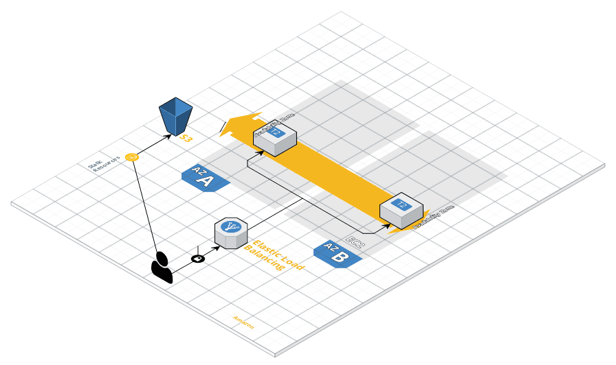

[](https://www.codetriage.com/terraform-aws-modules/terraform-aws-vpc)

Terraform module which creates VPC resources on AWS.

The following resources are created:

* [VPC](https://www.terraform.io/docs/providers/aws/r/vpc.html)
* [Subnet](https://www.terraform.io/docs/providers/aws/r/subnet.html)
* [Route](https://www.terraform.io/docs/providers/aws/r/route.html)
* [Route table](https://www.terraform.io/docs/providers/aws/r/route_table.html)
* [Classic Load Balancer](https://www.terraform.io/docs/providers/aws/r/elb.html)
* [S3 Bucket](https://www.terraform.io/docs/providers/aws/r/s3_bucket.html)

* [EC2 Instances](https://www.terraform.io/docs/providers/aws/r/instance.html)

## Usage with *terraform.tfvars* file

```hcl
module "storage" {
  source       = "./storage"
  project_name = "${var.project_name}"
}

module "networking" {
  source       = "./networking"
  vpc_cidr     = "${var.vpc_cidr}"
  public_cidrs = "${var.public_cidrs}"
  access_ip    = "${var.access_ip}"
}

module "compute" {
  source             = "./compute"
  instance_count     = "${var.instance_count}"
  key_name           = "${var.key_name}"
  public_key_path    = "${var.public_key_path}"
  instance_type      = "${var.instance_type}"
  subnets            = "${module.networking.public_subnets}"
  vpc_security_group = "${module.networking.public_sg}"
  subnet_ips         = "${module.networking.subnet_ips}"
}

module "loadbalancer" {
  source                = "./loadbalancer"
  lb_name               = "${var.lb_name}"
  avail_zones           = "${module.networking.avail_zones}"
  elb_subnets           = "${module.networking.subnet_ids}"
  elb_security_groups   = "${module.networking.security_group_ids}"
  lb_access_logs_bucket = "${module.storage.bucketname}"
  lb_access_logs_prefix = "${var.lb_access_logs_prefix}"
  lb_target_group_port  = "${var.lb_target_group_port}"
  lb_instances          = "${module.compute.server_ids}"
}
```

```hcl
aws_region = "us-east-1"

project_name = "project-terraform"

vpc_cidr = "10.123.0.0/16"

public_cidrs = ["10.123.1.0/24", "10.123.2.0/24"]

access_ip = "0.0.0.0/0"

instance_count = 2

key_name = "prod_key"

public_key_path = "/Users/path_to_your_key/.ssh/id_rsa.pub"

instance_type = "t2.micro"

lb_name = "prod-tf-lb"

load_balancer_is_internal = false

enable_deletion_protection = false

lb_access_logs_prefix = "prod-lb-logs"

lb_access_logs_is_enabled = true

lb_environment = "production"

lb_target_group_name = "prod-tf-target-group-lb"

lb_target_group_port = "80"
```

## Remote State

By default this module makes use of a remote state backend resource to store the terraform state in an S3 bucket.This is in the file *backend.tf* This bucket must be created before running a plan or apply to create the resources:

```hcl
terraform {
  backend "s3" {
    bucket = "your-bucket-name"
    key    = "terraform/terraform.tfstate"
    region = "us-east-1"
  }
}
```

### Architecture



### Future Enhancements:

* [Application Load Balancer](https://www.terraform.io/docs/providers/aws/r/lb.html)
* [Auto Scaling](https://www.terraform.io/docs/providers/aws/r/autoscaling_group.html)
* [RDS](https://www.terraform.io/docs/providers/aws/r/db_instance.html)
* [Route53 - DNS](https://www.terraform.io/docs/providers/aws/r/route53_record.html)


